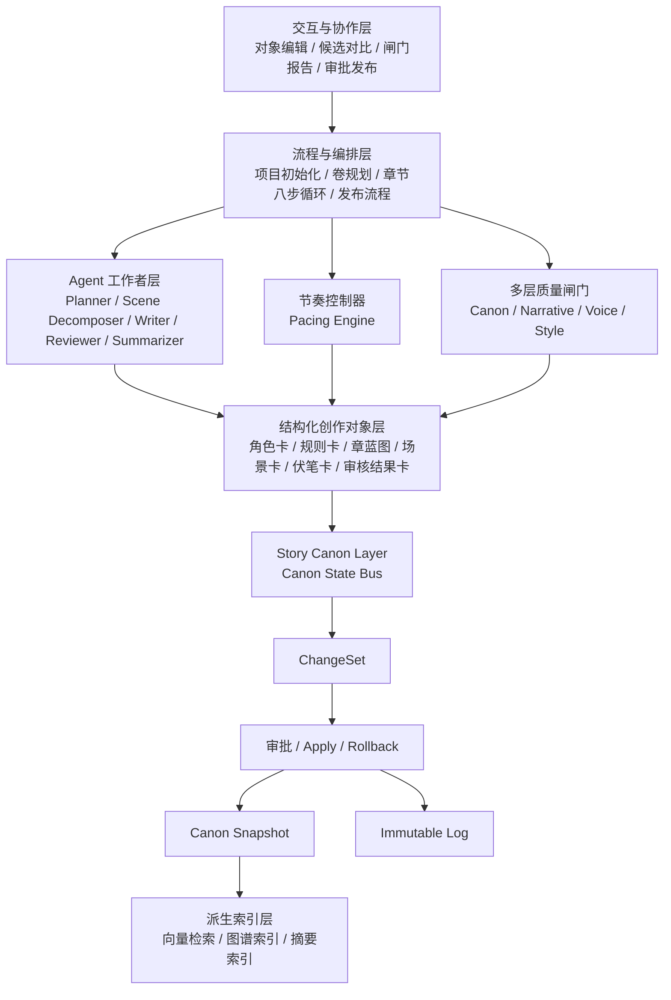

# 小说多 Agent 系统最终架构设计文档（V1）

## 1. 文档信息

- 文档名称：小说多 Agent 系统最终架构设计文档
- 版本：V1
- 文档状态：定版稿
- 文档定位：系统总体架构正式设计文档
- 适用范围：多题材、长篇、多章节、长期连载、人机协同创作系统
- 关联文档：
  - 《Story State / Canon State 状态模型设计（V1）》
  - 《结构化创作对象 Schema 设计（V1）》
  - 《Agent 契约说明（V1）》
  - 《章节循环工作流说明（V1）》
  - 《多层质量闸门设计（V1）》
  - 《题材配置层与规则包设计（V1）》
  - 《MVP 开发任务拆解（V1）》

---

## 2. 系统定位

本系统不是普通的“自动续写工具”，不是“单一强写作 Agent + RAG”的包装系统，也不是简单的“多 Agent 拼装式写作流水线”。

本系统的正式定位为：

**面向多题材长篇小说创作的多 Agent 创作控制系统。**

系统的核心目标，不是“生成下一段文本”，而是：

- 支撑长篇、多章节、长期连载创作
- 保持人物、设定、时间线、关系、伏笔的长期一致性
- 支撑不同题材下的可控创作与稳定扩展
- 将规划、写作、审阅、状态演化、版本回滚、人工决策纳入统一控制框架
- 使系统具备“长期创作不失控”的工程能力

因此，本系统本质上是一个：

**以 Story Canon / Story State 为真相中心，以工作流驱动多 Agent 执行，以结构化创作对象和质量闸门保障长期可控性的创作控制系统。**

---

## 3. 设计目标与非目标

### 3.1 设计目标

#### 1）长期一致性

- 人物身份、动机、关系、能力、经历可追踪
- 世界规则、术语、历史事件、设定约束不随章节漂移
- 时间线与事件因果关系可解释、可校验

#### 2）可控创作

- 写什么，不只由写作 Agent 临场决定
- 章节目标、冲突强度、信息揭示量、钩子位置、弧光推进应可控制
- 关键剧情节点支持多方案比较与人工选择

#### 3）多题材扩展

- 修仙、都市、校园、娱乐圈、悬疑等题材共享统一底座
- 题材差异通过配置层、规则包、模板包承载，而不是重写整套系统

#### 4）人机协同

- 将高杠杆决策点交给作者
- 将重复性组织工作、方案生成、草稿生产、结构校验交给系统
- 支持人工审批、人工选择、人工修订、人工发布

#### 5）工程可演化

- 支持变更集、回滚、审计、快照、索引重建、流程恢复
- 能从 MVP 平滑演进到多项目、多用户、平台化版本

### 3.2 非目标

V1 阶段不追求以下目标：

- 不追求“一次生成整本书”
- 不追求“所有能力都 Agent 化”
- 不追求“先做复杂 UI 再补内核”
- 不追求“用更强模型替代系统控制”
- 不追求“所有题材一步到位全支持”
- 不追求“先做平台壳，再证明创作闭环有效”

---

## 4. 核心设计原则

### 4.1 状态先于生成

长篇创作的首要问题不是生成能力不足，而是生成后的内容如何进入“可依赖的正史”。

因此系统必须以 **Story Canon / Story State** 为中枢。所有重要事实必须纳入状态管理；状态更新必须经过变更集、审核、落库与回滚机制，而不是让 Agent 直接改写真相。

### 4.2 结构先于提示词

角色、地点、规则、伏笔、章节蓝图、场景卡、审核结果等内容，不能只是散落在 prompt 中，而必须被对象化、结构化、可校验化。

系统优先依赖 **Schema-first Creative Objects**，而不是依赖长 prompt 拼接。

### 4.3 规划与写作分离

“怎么推进故事”与“把内容写出来”是两类不同任务，必须拆开。

因此系统必须将：

- 规划（卷、章、场景、候选剧情）
- 写作（正文草稿、语言表达）
- 状态更新（Canon 写入）
- 质量评审（多层质量闸门）

分为不同环节，而不是交给单一 Agent 一步完成。

### 4.4 单路径生成不可作为默认策略

复杂长篇叙事的关键节点，不应默认只有一个生成结果。

系统必须支持：

- 候选卷规划
- 候选章蓝图
- 候选场景拆解
- 局部重生成
- 方案比较与选择

### 4.5 质量控制必须分层

一致性检查不是全部质量控制。

系统至少应将质量拆为：

- Canon 一致性
- 叙事结构质量
- 人物声音与行为合理性
- 风格与语言稳定性
- 节奏与信息密度

### 4.6 Agent 是执行者，不是中枢

Agent 不应该既写正文、又改正史、又更新图谱、又审批自己。

系统主线应为：

**Workflow > Story State Bus > Creative Objects > Quality Gates > Agent Workforce**

### 4.7 人类介入点必须内建

作者不是补丁位，而是系统中的关键决策者。

必须把以下环节设计成高杠杆人工介入点：

- 题材模板选择
- 卷规划确认
- 候选章蓝图选择
- 关键转折确认
- 重大设定修改审批
- 伏笔回收决策
- 最终发布确认

---

## 5. 总体架构

系统采用“通用底座 + 题材配置层 + 规则包 / 插件层”的总体思路，并在运行时形成“五层核心架构”。

### 5.1 五层总体分层

#### 第一层：创作真相层（Story Canon Layer）

这是系统最内核的一层，负责维护全书真相与状态演化。

包含：

- Canon State Bus
- ChangeSet 变更集机制
- Immutable Log 不可变事件日志
- Canon Snapshot 正史快照
- Working / Speculative State 工作态与推演态

职责：

- 维护当前正史
- 记录状态演化历史
- 承载审批与回滚
- 作为下游生成、检索、评审的唯一可信事实来源

#### 第二层：结构化创作对象层（Creative Object Layer）

这一层负责承载所有“可被生成、引用、校验、审核、复用”的创作中间对象。

包含：

- 角色卡
- 地点卡
- 势力卡
- 物品卡
- 世界规则卡
- 时间线事件卡
- 伏笔卡 / Open Loop 卡
- 卷蓝图
- 章蓝图
- 场景卡
- 审核结果卡
- 节奏约束卡
- 读者钩子卡

职责：

- 让创作对象脱离自由文本
- 为规划、生成、审阅提供统一对象协议
- 支持对象引用、对象版本、对象校验、对象关系映射

#### 第三层：流程与编排层（Workflow & Orchestration Layer）

这一层是系统主线，负责驱动创作流程，而不是让 Agent 自由游走。

包含：

- 项目初始化流程
- 题材模板初始化流程
- 卷规划流程
- 章节八步循环流程
- 审阅修订流程
- Canon 变更审批流程
- 发布流程
- 索引重建与派生更新任务

职责：

- 控制每一步的输入输出
- 定义状态转移
- 管理任务执行、失败重试、暂停恢复
- 限制 Agent 权限边界

#### 第四层：Agent 工作者层（Agent Workforce Layer）

这一层只承担“必须依赖生成式智能”的工作。

建议包含：

- Planner Agent（规划）
- Scene Decomposer Agent（场景拆解）
- Writer Agent（正文生成）
- Rewriter Agent（修订润色）
- Canon Review Agent（一致性审查）
- Narrative Review Agent（叙事审查）
- Voice Review Agent（人物声音审查）
- Style Review Agent（风格审查）
- Change Proposal Agent（变更提议）
- Summarizer Agent（章节摘要 / 状态摘要）

职责：

- 生成候选内容
- 进行难以规则化的评估
- 提供修改建议
- 不直接写入 Canon 真相

#### 第五层：交互与协作层（Interaction Layer）

这是面向作者、编辑、运营、调试者的控制面板层。

包含：

- 对象编辑界面
- 候选方案对比界面
- 闸门报告界面
- 变更集审批界面
- 项目进度与任务中心
- 版本 / 快照 / 回滚界面
- 题材模板与规则包管理界面

职责：

- 暴露关键控制点
- 支持人工选择与审批
- 提供可观测性
- 避免 UI 退化为单一写字框

### 5.2 总体架构图（Mermaid）

---

## 6. 核心状态模型与写入协议

### 6.1 Story Canon 三态模型

为避免长篇系统后期状态失控，Canon 必须拆为三类状态：

#### 1）Immutable Log（不可变事件日志）

用于记录“发生了什么”。

示例：

- 第 12 章已发布
- 角色“顾长渊”的身份标签新增“内门弟子”
- 伏笔“禁制裂纹来源”状态从 open 变为 remind
- 关系“顾长渊 - 沈清漪”亲密度阶段从试探变为并肩

特点：

- 只追加，不覆盖
- 可审计
- 可重放
- 可回溯

#### 2）Canon Snapshot（正史快照）

用于表示“当前系统认定的真相视图”。

包含：

- 当前人物状态
- 当前世界规则
- 当前时间线
- 当前关系图
- 当前 open loops
- 当前术语与能力体系状态
- 已发布章节元数据

特点：

- 供生成、检索、校验直接使用
- 来源必须可追溯到已审批的 ChangeSet
- 不能被 Agent 直接任意修改

#### 3）Working / Speculative State（工作态 / 推演态）

用于承载尚未确认的内容。

包括：

- 候选卷规划
- 候选章蓝图
- 候选场景拆解
- 推演分支
- 未审批设定补丁
- 审阅意见草案

特点：

- 可丢弃
- 可替换
- 可并行存在多个版本
- 不属于正史

### 6.2 Canon 写入协议

系统中任何对正史的修改，都必须走统一写入协议。

标准流程为：

1. 生成内容或规划内容
2. 从内容中提取状态变化
3. 形成 ChangeSet 变更集
4. 进入质量闸门
5. 人工审批或规则自动审批
6. Apply 到 Canon Snapshot
7. 写入 Immutable Log
8. 触发派生索引更新

### 6.3 ChangeSet 基本结构

每个 ChangeSet 至少应包含：

- changeset_id
- source_type（章节发布 / 人工编辑 / 规则修复 / 系统提议）
- source_ref（对应章蓝图 / 章节 / 对象版本）
- proposed_by（Agent / Human / Service）
- affected_objects
- before_snapshot_refs
- patch_operations
- rationale
- review_status
- approved_by
- applied_at
- rollback_ref

### 6.4 写入边界规则

必须明确以下约束：

- Agent 不能直接写 Canon Snapshot
- Agent 只能提出 Change Proposal
- Workflow 服务负责落地写入
- 图谱、向量索引、检索摘要等都属于派生层，不是真相层
- 发布前状态不得自动变成 Canon 正史
- 重大设定修改必须人工审批

---

## 7. 结构化创作对象层设计

### 7.1 核心对象类别

V1 阶段建议至少定义以下对象：

#### 基础世界对象

- CharacterCard（角色卡）
- LocationCard（地点卡）
- FactionCard（势力卡）
- ItemCard（物品卡）
- RuleCard（世界规则卡）
- TerminologyCard（术语卡）

#### 叙事对象

- TimelineEvent（时间线事件卡）
- OpenLoopCard（伏笔卡）
- RelationshipEdge（关系边）
- ArcCard（人物弧光卡）
- VolumeBlueprint（卷蓝图）
- ChapterBlueprint（章蓝图）
- SceneCard（场景卡）
- HookCard（读者钩子卡）

#### 控制对象

- PacingConstraintCard（节奏约束卡）
- ReviewResultCard（审核结果卡）
- ChangeProposalCard（变更提议卡）
- PublishRecord（发布记录）

### 7.2 对象设计要求

每类对象都应满足：

- 有明确 schema
- 可版本化
- 可引用
- 可校验
- 可追踪来源
- 可标记状态
- 可关联 Canon 状态变化

### 7.3 对象间关系

对象间必须允许引用，但引用必须可追踪。

例如：

- 章蓝图引用角色卡、规则卡、OpenLoopCard
- 场景卡引用章蓝图、角色卡、地点卡
- 审核结果卡引用对应对象版本
- ChangeProposalCard 引用被修改对象及章节来源

---

## 8. 章节循环主流程

系统采用“章节八步循环”作为章节级核心工作流。

### 第一步：目标与节奏输入

输入：

- 当前 Canon Snapshot
- 当前卷目标
- 当前章位次
- 题材配置
- 上章摘要
- 未回收 open loops

输出：

- 本章结构化目标
- 冲突等级
- 信息揭示量
- 主视角要求
- 钩子位置要求
- 必须承接要素
- 禁止事项

这一阶段由 **Pacing Engine** 与规则服务主导，不由 Writer 自行决定。

### 第二步：候选章蓝图生成

由 Planner Agent 生成 3~7 个章蓝图候选。

每个候选必须显式标明：

- 本章推进了什么
- 引入 / 回收了哪些伏笔
- 推进了哪些人物弧光
- 使用了哪些 Canon 事实
- 风险点在哪里

### 第三步：候选方案过滤与选择

先用硬规则进行过滤，再进入人工选择。

筛掉：

- 明显违背世界规则的
- 明显破坏角色逻辑的
- 与主线节奏冲突的
- 与当前卷目标偏离过大的

作者在这一阶段选定最终章蓝图，并可局部修改。

### 第四步：场景拆解

Scene Decomposer Agent 将章蓝图拆为场景序列。

每个 SceneCard 至少包含：

- scene_id
- scene_goal
- participating_entities
- conflict_type
- emotional_curve
- information_delta
- open_loop_actions
- expected_transition

### 第五步：正文生成

Writer Agent 按场景逐段生成。

Writer 的上下文应来自：

- 章蓝图
- 场景卡
- 相关角色卡
- 相关规则卡
- 最近章节摘要
- 当前 open loops
- 必要语料样本 / 人物声音样本

而不是把全书粗暴塞进上下文。

### 第六步：多层质量闸门

正文草稿生成后，不直接发布，而要进入多层质量闸门。

至少经过：

- Canon Gate
- Narrative Gate
- Character Voice Gate
- Style Gate

如有需要，再进入：

- Pacing Gate
- Safety Gate
- Repetition Gate

### 第七步：变更集提议

系统从已通过闸门的章节草稿中提取状态变化，形成 ChangeSet。

包括：

- 新增事实
- 状态变化
- 关系变化
- 时间线推进
- 伏笔状态变化
- 新术语 / 新地点 / 新事件

### 第八步：审批与发布

作者或编辑审批 ChangeSet 后：

- Apply 到 Canon Snapshot
- 写入 Immutable Log
- 标记章节已发布
- 更新派生索引
- 进入下一章循环

---

## 9. 节奏控制器（Pacing Engine）

### 9.1 设计目标

节奏不是“写作感觉”，而是系统应明确建模的控制变量。

Pacing Engine 的职责是：

- 根据题材类型给出节奏模板
- 根据卷阶段给出本章节奏目标
- 根据近期章节状态纠偏节奏失衡
- 为候选方案打分
- 为质量闸门提供节奏指标

### 9.2 V1 最小节奏指标

MVP 阶段先控制以下三个指标：

#### 1）钩子位置

本章是否在预期位置形成期待点、反转点、悬念点或爽点。

#### 2）信息揭示量

本章新增信息量、揭示密度、解释与行动比例是否合理。

#### 3）冲突升级等级

本章相较前章是否有冲突推进，推进幅度是否符合当前阶段。

### 9.3 后续可扩展节奏指标

V2 / V3 可扩展为：

- 情绪曲线幅度
- 爽点间隔
- 高能点密度
- 伏笔提醒频率
- 关系推进速度
- 支线 / 主线权重
- 叙事速度
- 视角切换频率
- 战斗 / 日常 / 信息铺垫比例

---

## 10. 多层质量闸门体系

### 10.1 总体原则

质量闸门不是一个“大审稿 Agent”，而是一组职责明确、输入输出清晰的控制机制。

### 10.2 核心闸门定义

#### Canon Gate

目标：

- 检查设定、时间线、人物状态、关系状态、能力约束是否冲突

输入：

- 草稿文本
- 本章蓝图
- Canon Snapshot
- 相关对象引用

输出：

- pass / fail
- 冲突清单
- 冲突等级
- 建议修复点

#### Narrative Gate

目标：

- 检查本章是否完成既定推进
- 是否存在结构塌陷、过渡断裂、推进不足、信息堆砌

输入：

- 章蓝图
- 场景卡
- 草稿文本

输出：

- 推进完成度
- 场景合理性
- 节点缺失报告
- 修订建议

#### Character Voice Gate

目标：

- 检查人物言行是否符合角色身份、语气、动机、关系阶段

输入：

- 角色卡
- 声音样本
- 草稿文本

输出：

- 人物偏移点
- 口癖 / 语气偏移
- 行为不合理项
- 修订建议

#### Style Gate

目标：

- 检查整体文风、语言重复、叙述稳定度、题材语体适配度

输入：

- 题材风格配置
- 草稿文本
- 历史风格样本

输出：

- 风格偏差报告
- 重复表达报告
- 用语失真报告

### 10.3 闸门执行原则

- 硬规则优先于 LLM 评审
- 结构化指标优先于纯主观评价
- 单一闸门失败不直接覆盖原文，而是形成修订建议
- 闸门结果必须可追踪、可比较、可复盘

---

## 11. Agent 体系设计

### 11.1 Agent 角色边界

Agent 只处理以下任务：

- 创意扩展
- 候选方案生成
- 场景拆解
- 正文写作
- 局部重写
- 风格润色
- 难以规则化的评审

Agent 不应负责：

- 直接写 Canon Snapshot
- 直接修改正史对象
- 直接更新图谱真相
- 跳过审批直接发布
- 同时生成内容又作为唯一审批者

### 11.2 推荐 Agent 列表

#### 规划类

- Planner Agent
- Volume Planner Agent
- Chapter Planner Agent

#### 拆解类

- Scene Decomposer Agent
- Arc Mapper Agent
- Open Loop Planner Agent

#### 生成类

- Writer Agent
- Rewriter Agent
- Dialogue Enhancer Agent

#### 审阅类

- Canon Review Agent
- Narrative Review Agent
- Voice Review Agent
- Style Review Agent

#### 状态辅助类

- Summarizer Agent
- Change Proposal Agent
- Metadata Extractor Agent

---

## 12. 存储与索引职责划分

系统必须明确“真相”和“检索线索”不是一回事。

### 12.1 关系型存储

负责：

- Canon Snapshot
- Creative Objects
- ChangeSet
- 审批记录
- 发布记录
- 工作流状态

定位：

**结构化真相存储**

### 12.2 日志 / 事件存储

负责：

- Immutable Log
- 事件流
- 回放与审计

定位：

**可追溯状态演化来源**

### 12.3 向量索引

负责：

- 语义相似召回
- 历史片段召回
- 风格样本召回
- 人物语料召回

定位：

**生成辅助检索层**

不是正史层。

### 12.4 图谱索引

负责：

- 人物关系遍历
- 伏笔链路追踪
- 势力与事件关系查询
- 派生关系展示

定位：

**派生关系索引层**

也不是真相层。

---

## 13. 多题材扩展机制

### 13.1 总体策略

系统采用：

**通用底座 + 题材配置层 + 规则包 / 插件层**

### 13.2 通用底座负责

- Story Canon 机制
- Creative Objects
- Workflow
- ChangeSet / 审批 / 回滚
- 质量闸门
- 基础 Agent 契约
- 任务中心
- 存储与索引协议

### 13.3 题材配置层负责

- 题材世界观倾向
- 题材人物关系范式
- 题材冲突类型偏好
- 题材节奏模板
- 常用对象模板
- 风格约束
- 禁忌项
- 章节结构建议

### 13.4 规则包 / 插件层负责

- 修仙专用术语规则
- 娱乐圈舆论链规则
- 校园日常关系规则
- 悬疑线索披露规则
- 都市升级线节奏规则
- 专题生成器与检查器

---

## 14. MVP 范围

### 14.1 P0 必做

#### 1）Canon State Bus 雏形

至少覆盖：

- 角色卡
- 世界规则卡
- 时间线事件
- OpenLoopCard
- 章节元数据
- ChangeSet 审批与应用

#### 2）最小结构化对象层

至少落地：

- CharacterCard
- RuleCard
- ChapterBlueprint
- SceneCard
- OpenLoopCard
- ReviewResultCard

#### 3）章节简化八步循环

至少落地：

- 候选章蓝图（至少 3 个）
- 人工选择
- 场景拆解
- 正文生成
- Canon Gate + Style Gate
- ChangeSet 提议
- 人工审批
- 发布

#### 4）最小节奏控制

至少支持：

- 钩子位置
- 信息揭示量
- 冲突升级等级

#### 5）最小交互控制面板

至少支持：

- 候选蓝图选择
- 对象查看
- 闸门报告查看
- ChangeSet 审批

### 14.2 P1 可延后

- 图谱可视化
- 复杂多用户权限
- 成本追踪
- 模型池
- 提示词治理后台
- 高级统计分析
- 插件市场
- 大规模批量生成
- 多端编辑器体验

---

## 15. 关键风险与控制策略

### 15.1 风险一：过度 Agent 化

表现：

- 权限边界混乱
- 状态并发覆盖
- 行为不可复现

控制：

- Workflow 主导
- Agent 只做执行
- Canon 写入统一协议化

### 15.2 风险二：对象层名存实亡

表现：

- 表面有卡片，实际还在拼 prompt
- 对象无法校验、不可复用

控制：

- 强制 schema
- 强制对象引用
- 强制对象级审核结果

### 15.3 风险三：候选方案成本爆炸

表现：

- 每层都多候选，成本和复杂度失控

控制：

- 只在关键决策点启用多方案
- 常规节点默认单路径执行
- 允许局部重生成，不做全链重算

### 15.4 风险四：质量闸门退化成大 prompt

表现：

- 评审不可解释
- 结果不稳定
- 修订无依据

控制：

- 闸门分层
- 输出结构化报告
- 规则与 LLM 混合评审

### 15.5 风险五：MVP 被平台工程拖死

表现：

- 还没证明创作闭环有效，就投入大量 UI、权限、平台能力

控制：

- 先证明“连续多章稳定不崩”
- 后补平台化能力
- 先控制中枢，后扩产品壳

---

## 16. V1 定版结论

本系统最终采用的核心架构路线为：

**Story Canon / Story State 总线 + 结构化创作对象层 + 候选方案层 + 节奏控制器 + 多层质量闸门 + 工作流驱动的 Agent 执行体系。**

这意味着系统主线不是：

- 堆更多 Agent
- 堆更多记忆
- 堆更长 prompt
- 堆更重 UI

而是：

- 先确立真相中心
- 再确立结构化对象
- 再确立流程主线
- 再把 Agent 放回执行位
- 再用节奏与闸门保障质量
- 最后用配置层与规则包扩展多题材

该路线的目标不是“会写”，而是“长期稳定地写、按目标写、可追踪地写、可回滚地写”。

---

## 17. 后续配套文档

本架构文档定版后，应立即补齐以下文档：

1. 《Story State / Canon State 状态模型设计（V1）》
2. 《结构化创作对象 Schema 设计（V1）》
3. 《Agent 契约说明（V1）》
4. 《章节循环工作流说明（V1）》
5. 《多层质量闸门设计（V1）》
6. 《题材配置层与规则包设计（V1）》
7. 《MVP 开发任务拆解（V1）》
